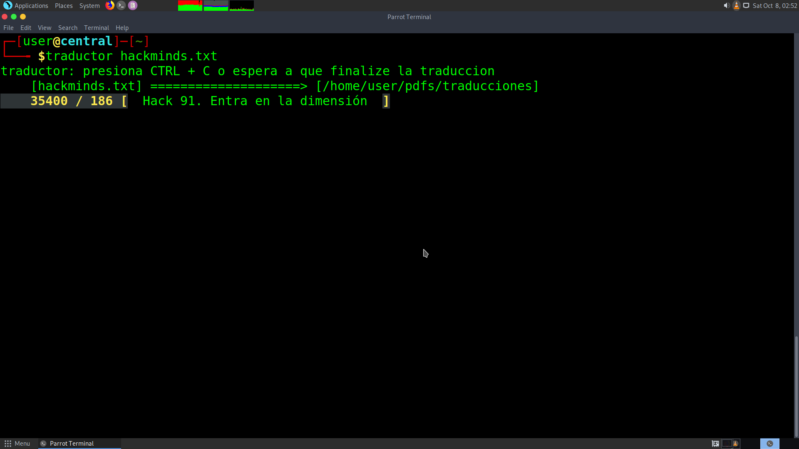

# traductor de terminal.
Procesamiento de lenguaje natural.
Actualmente estoy usando este proyecto para procesamiento de big data para extraccion de conocimiento.
** este script esta en desarrollo **

uso: 
```
  ./traductor  [fichero de texto]
```

extra:
```
  ./tips
```
